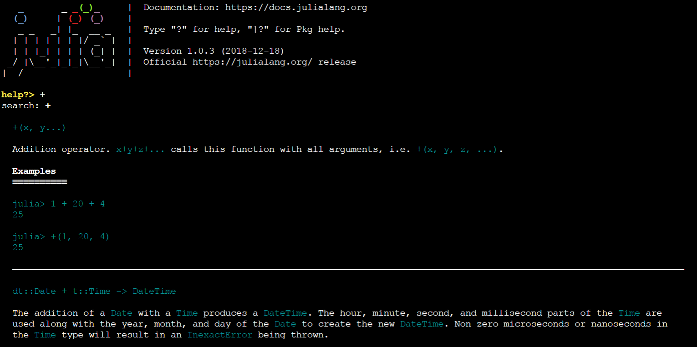
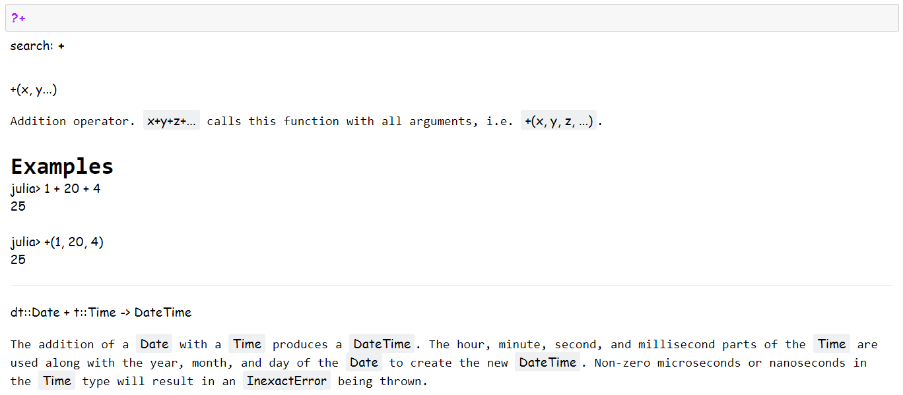
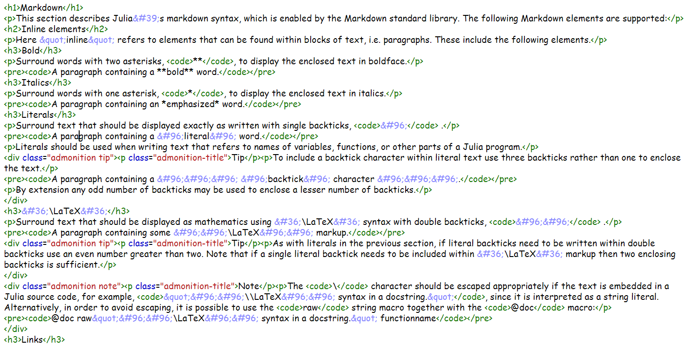
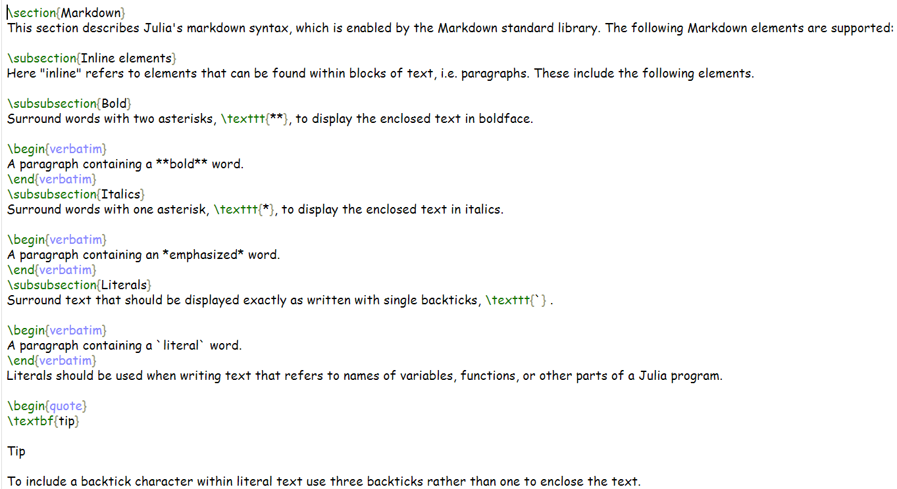

<h1>Table of Contents<span class="tocSkip"></span></h1>
<div class="toc"><ul class="toc-item"><li><span><a href="#从-docstring-开始" data-toc-modified-id="从-docstring-开始-1"><span class="toc-item-num">1&nbsp;&nbsp;</span>从 docstring 开始</a></span></li><li><span><a href="#利用-@doc-进行注释" data-toc-modified-id="利用-@doc-进行注释-2"><span class="toc-item-num">2&nbsp;&nbsp;</span>利用 @doc 进行注释</a></span></li><li><span><a href="#实现-MD-实例:-从字符串到-MD-对象" data-toc-modified-id="实现-MD-实例:-从字符串到-MD-对象-3"><span class="toc-item-num">3&nbsp;&nbsp;</span>实现 MD 实例: 从字符串到 MD 对象</a></span><ul class="toc-item"><li><span><a href="#用宏和函数解析-markdown-字符串" data-toc-modified-id="用宏和函数解析-markdown-字符串-3.1"><span class="toc-item-num">3.1&nbsp;&nbsp;</span>用宏和函数解析 markdown 字符串</a></span></li><li><span><a href="#函数式编程组建-markdown-结构" data-toc-modified-id="函数式编程组建-markdown-结构-3.2"><span class="toc-item-num">3.2&nbsp;&nbsp;</span>函数式编程组建 markdown 结构</a></span></li></ul></li><li><span><a href="#MD-对象转化成-String" data-toc-modified-id="MD-对象转化成-String-4"><span class="toc-item-num">4&nbsp;&nbsp;</span>MD 对象转化成 String</a></span></li><li><span><a href="#实现文档类型转化:-md-文件-转化成-html-文件和-tex-文件" data-toc-modified-id="实现文档类型转化:-md-文件-转化成-html-文件和-tex-文件-5"><span class="toc-item-num">5&nbsp;&nbsp;</span>实现文档类型转化: md 文件 转化成 html 文件和 tex 文件</a></span></li></ul></div>


Julia 的标准库 `Markdown.jl` 可灵活高效地解析 markdown, 从 Julia 0.4 版本开始, `Markdown.jl` 便成为 Julia 的基础库. 

当我们从 REPL 进入帮助模式(按 `?` 键), 或者在 Jupyter Notebook 中使用 `?` 查看函数的帮助信息时, 丰富多彩的帮助文字背后即是 `Markdown.jl` 在发挥作用.

---


# 从 docstring 开始

查看 `+` 的说明文档时, 你会发现字体、颜色、样式并不是唯一的，这是如何实现的呢





>  要弄清楚这一点, 我们需要引入几个 macro 和 `MD` 这个函数


```julia
using Markdown
using Markdown: @doc, @doc_str, MD
```

> 首先将 `+` 的 docstr 保存下来, 使用 @doc 保存到 *doc* 变量, 可以发现, *doc* 的类型是 **MD**, 这种类型就是 markdown 在 Julia 中的被解析的对象, 且 **MD** 有两部分, 一部分是 *meta*, 反映函数的元信息, 另一部分是 *content* 是一个类型为 **MD** 的一维 array, 用来具体说明函数的用法. 也就是说, docstring 可以由各种 **MD** 实例组成.


```julia
doc = @doc +; # type: MD
doc.meta
```


    Dict{Any,Any} with 3 entries:
      :typesig => Union{}
      :binding => Base.:+
      :results => Base.Docs.DocStr[DocStr(svec("    +(x, y...)\n\nAddition operator…


```julia
doc.content
```


    2-element Array{Any,1}:
     ```
    +(x, y...)
    ```
    
    Addition operator. `x+y+z+...` calls this function with all arguments, i.e. `+(x, y, z, ...)`.
    
    # Examples
    
    ```jldoctest
    julia> 1 + 20 + 4
    25
    
    julia> +(1, 20, 4)
    25
    ```


> 那么你会想到, 如果我们有了 `MD` 各种实例, 如何重新组合成完整的 docstring 呢?
>
> `MD` 函数可以帮助你实现. 它接受两种类型方法
>
> - 传入类型为 **MD** 的一维 array 时, 可组合起来形成一个新的 **MD**
>
> - 传入类型为 **Dict** 类型时, 可添加到 **MD** 实例的 meta 部分, 作为辅助说明
>
> 根据这个思路, 你可以写出 `+` 的 *伪* docstr

```julia
docPseudo = MD(Vector{MD}(
        [doc.content[1], doc.content[2]]
        )
);
docPseudo.meta = Dict(:typesig => Union{}, :binding => Base.:+, :results => docPseudo);
docPseudo # 结果和 + 的文档是一样的, 限于篇幅就不放上来了
```

---


# 利用 @doc 进行注释

> 从上面的讨论中, 我们知道 文档字符串在 Julia 中就是 MD 对象, 那么如何将字符串"变成"函数的文档呢?
>
> 答案: 使用 `@doc` 宏
>
> 利用命令 `@doc @doc` 或者 `?@doc`, 你会发现 `@doc` 有两个功能:
>
> 1. 获取某个对象（函数、宏、变量）的文档
> 2. 给某个对象（函数、宏、变量）添加文档
>
> 你或许已经知道，在 Julia 中我们在函数体前用 `"""` 给函数做注释：

    """
    print `param` (take **Int** type as the argument)
    
    # First Examples
    
    ```julia
    julia> str = "Hello World\n"
    julia> Print(str*str)
    $(let str = "Hello World"
        str*str
    end)
    ```
    """
    function Print(param::String)
        println(param)
        end

> 但在 REPL 中, 以上方式会无法将字符串解析成文档字符串(运行结果只是单纯的一段字符串和一个函数体), 使用 `md` `doc` 字符串宏给函数做注释时会报 `ERROR: syntax` 语法错误
>
> 这时应使用 `@doc` 宏和 `->` 符号给函数(或者任何你想要注释的对象)做注释

    @doc """
    print `param` (take **Float64** type as the argument)
    
    # Second Examples
    
    ```julia
    julia> r = rand()
    julia> Print(r)
    $(let r=rand()
        r
    end)
    ```
    """ ->
    function Print(param::Float64)
        println(param)
        end

>  或者

    docstring = """
    print `param` (take **String** type as the argument)
    
    # Third Examples
    
    ```julia
    julia> Print(1)
    1
    ```
    """;
    
    @doc docstring Print(param::Int) = print(param)

> 查看 `Print` 的文档: 

```julia
?Print
```


print `param` (take **Int** type as the argument)

# First Examples

```julia
julia> str = "Hello World
"
julia> Print(str*str)
Hello WorldHello World
```

---

print `param` (take **Float64** type as the argument)

# Second Examples

```julia
julia> r = rand()
julia> Print(r)
0.40218381068451414
```

---

print `param` (take **String** type as the argument)

# Third Examples

```julia
julia> Print(1)
1
```

> 你会惊喜地发现, 随着 method 的增加, docstring 也能够依次增加, 并且如果需要覆盖某种 method, 只需要重新使用 `@doc` 进行注释


```julia
@doc "# Same Type as String" Print(param::String) = print(param);
?Print # 或者 @doc Print
```

# Same Type as String

---

print `param` (take **Float64** type as the argument)

# Second Examples
......(后面的内容省略)

> 除了函数, Julia 还可以对常量、变量、数组或者其他类型的对象进行注释


```julia
# 对 MD 对象进行注释
mdObject = doc"mdObject"
@doc "this belongs to `md` object" mdObject
@doc mdObject
# 结果为: this belongs to `md` object
```


```julia
# 对常量注释
@doc "# Constant
**$(typeof(imag))** type

the square is $(imag*imag)" -> 
const imag = 1im

@doc imag
```


# Constant

**Complex{Int64}** type

the square is -1 + 0im


> 从上面这个例子可以看到, Julia 的插值功能非常强大, Julia 能够先将变量的值"计算"出来, 然后"链接"到 docstring. 然而 docstring 并非能够动态地把值"链接"过来, 请看以下例子:


```julia
@doc "# Vector of Random Variables
param `n`: length of the vector
defalut `n` = $(length(num))
"  num = rand(3);
@doc num
```


# Vector of Random Variables

param `n`: length of the vector

defalut `n` = 3


```julia
num= rand(1);
@doc num
```


# Vector of Random Variables

param `n`: length of the vector

defalut `n` = 3


>更改了 **num** 的值, 但是 docstring 依然是第一次赋值的结果, 在很多场景下这非常实用, 尤其是对常量注释
>
>但是我们可以遵循之前讨论的思路, 用新的 MD 对象进行覆盖

```julia
@doc "# Vector of Random Variables
param `n`: length of the vector

defalut `n` = $(length(num))
"  num = rand(100)

@doc num
```


# Vector of Random Variables

param `n`: length of the vector

defalut `n` = 100

---


# 实现 MD 实例: 从字符串到 MD 对象


>接下来, 你会想知道, 如何写出 **MD** 实例, 有两种方式:
>
>1. 对符合 markdown 语法的字符串，使用 `md` 和 `doc` 字符串宏 (string macro)、`@doc_str` 宏(macro) 、`Markdown.parse()`函数直接转化成 MD 对象
>2. 对普通字符串，使用 `Markdown.jl`的相关函数: Header、 LaTeX、 Image、 Link、 Bold、 Italic、 Table、 Code、 Footnote、 Paragraph 等进行相应地组建 markdown 结构


## 用宏和函数解析 markdown 字符串


```julia
md_logo = md"""
# Julia Icon


""";


doc_str_logo = @doc_str """
# Julia Dragon Icon

""";

str = """
# Julia Three-Balls Icon

"""
parse_logo = Markdown.parse(str);

mdChunk = MD(Vector{MD}(
        [doc_str_logo, md_logo, parse_logo]
        )
)
```

# Julia Dragon Icon


# Julia Icon


# Julia Three-Balls Icon


> 在解析含有插值字符串时, 这三种方式略有不同, `md` 字符串宏会把不会对插值代码求值, `parse` 函数会对插值求值, 而 `@doc_str` 宏无法解析含有插值的字符串


    md"""
    print `str` (only take **String** type as the argument)
    
    # Examples
    
    ```julia
    julia> Print("Hello World")
    $(let str="Hello World"
       str
      end
    )
    ```
    """

print `str` (only take **String** type as the argument)

# Examples

```julia
julia> Print("Hello World")
$(let str="Hello World"
   str
  end
)
```

<br>


    Markdown.parse("""
    print `str` (only take **String** type as the argument)
    
    # Examples
    
    ```julia
    julia> Print("Hello World")
    $(let str="Hello World"
       str
      end
    )
    ```
    """)

print `str` (only take **String** type as the argument)

# Examples

```julia
julia> Print("Hello World")
Hello World
```

<br>


    @doc_str """
    print `str` (only take **String** type as the argument)
    
    # Examples
    
    ```julia
    julia> Print("Hello World")
    $(let str="Hello World"
       str
      end
    )
    ```
    """

<br>

    MethodError: no method matching @doc_str(::LineNumberNode, ::Module, ::Expr)
    Closest candidates are:
      @doc_str(::LineNumberNode, ::Module, !Matched::AbstractString, !Matched::Any...) at /buildworker/worker/package_linux64/build/usr/share/julia/stdlib/v1.3/Markdown/src/Markdown.jl:56

---


## 函数式编程组建 markdown 结构


```julia
using Markdown
using Markdown: MD,  Header, Italic, Bold,  plain, Code, LaTeX, Paragraph, html
```

> 根据 markdown 语法和 HTML 结构, 我们知道 md 中的 `# title` 写法其实是对应 html 的 `<h1>title<\h1>`
> 在 Julia 中, 用函数的方式把 **h1** 生成相应 MD 对象的过程是: 先使用 `Header()` 生成 **Header** 对象, 再用 `MD()` 函数接收一维数组, 把数组所有内容转化成一个整体的 MD 对象:


```julia
h1 = Header("title") # type => Header{1}
md_header = MD(h1) # type => MD
md_header == md"# title" # => 结果: true
```


> 再看一个简单的 md 语句 md1


```julia
 md1 = md"foo *italic foo* **bold foo** `code foo`"
```

foo *italic foo* **bold foo** `code foo`


> 如果我们需要实现 md1 的 markdown 结构, 用函数的形式, 需要写成


```julia
md2 = MD(Paragraph(["foo ", Italic("italic foo"), " ", Bold("bold foo"), " ",  Code("code foo")]))
md1 == md2 # => 结果: true
```

> 同样地, 我们可以"合并"不同类型的数据作为一个整体的 `MD` 对象:


```julia
md3 = md"""inline $\LaTeX$ formula 

$\frac{1}{2}$

interline formula $$\frac{1}{2}$$
""";

LATEX = LaTeX("\\text{end with}\\, \\LaTeX \\cdots");
v = [Header("MD 实例"), md3, 
    Header("MD 实例转化的普通字符串"), plain(md3),
    Header("LaTeX 公式"), LATEX]
md_v = MD(v);

map(x->typeof(x), vcat(v, md_v))
```

    7-element Array{DataType,1}:
     Header{1}
     MD       
     Header{1}
     String   
     Header{1}
     LaTeX    
     MD       


> `@doc`的第一个参数不仅支持字符串, 还支持 MD 对象:


```julia
o5 = .5;
@doc md_v o5;
@doc o5
```

# MD 实例

inline $\LaTeX$ formula 

$$
\frac{1}{2}
$$

interline formula $\frac{1}{2}$

# MD 实例转化的普通字符串

"inline \$\\LaTeX\$ formula \n\n\$\$\n\\frac{1}{2}\n\$\$\n\ninterline formula \$\\frac{1}{2}\$\n"

# LaTeX 公式

$$
\text{end with}\, \LaTeX \cdots
$$

---


# MD 对象转化成 String

> MD 对象可以转化成以下三种字符串:
> - md 格式的字符串: `plain()` 函数
> - html 格式的字符串: `html()` 函数
> - tex 格式的字符串: `latex()` 函数


```julia
 md1 = md"foo *italic foo* **bold foo** `code foo`"
```

foo *italic foo* **bold foo** `code foo`


```julia
plain(md1)
```

    "foo *italic foo* **bold foo** `code foo`\n"


```julia
html(md1)
```

    "<p>foo <em>italic foo</em> <strong>bold foo</strong> <code>code foo</code></p>\n"


```julia
latex(md1)
```

    "foo \\emph{italic foo} \\textbf{bold foo} \\texttt{code foo}\n\n"

---


# 实现文档类型转化: md 文件 转化成 html 文件和 tex 文件


> MD 对象不仅可以用于添加文档说明, 还可以实现 markdown 与其他文档类型相互转化
> 比如我们有一个 markdown 文件 (为方便说明,  我们从 github 上下载 Markdown.jl 的 md 文档)


```julia
using HTTP

url = "https://raw.githubusercontent.com/JuliaStdlibs/Markdown.jl/master/docs/src/index.md"
r = HTTP.request("GET", url; verbose=1); 
# verbose 参数用于打印请求的客户端和服务器之间信息流, 0 表示不显示信息, 1 表示打印最简单的交互信息, 2 表示打印 request 请求和 response 响应内容信息, 3 表示打印详细的 Debug 信息

mdString = String(r.body); # type: str
open(f -> write(f, mdString), "index.md", "w"); # 保存成名为 index.md 的本地文件
```

```julia
# 将本地 md 文件解析成 MD 对象
mdInstance = Markdown.parse_file(joinpath(pwd(), "index.md")); # => type: MD
```

> 你可以先把 MD 对象转化成 String, 然后把 String 保存成文本文件:


```julia
mdHtml = html(mdInstance); # => type: str 
open(f -> write(f, mdHtml), "index.html", "w");
```


```julia
mdLatex = latex(mdInstance); # => type: str 
open(f -> write(f, mdLatex), "index.tex", "w");
```

而另外一种简便的转化方法是使用 `html(io::IO, md::MD)` `latex(io::IO, md::MD)` 方法, 直接进行 IO 操作 (这得益于 [multiple dispatch](https://docs.julialang.org/en/v1/manual/methods/index.html))


```julia
open(f->Markdown.html(f, mdInstance), "readme.html", "w")
# 等价于
# io = open("readme.html", "w");
# Markdown.html(io, mdInstance);
# close(io)
# 或者使用 tohtml 函数
# open(f->Markdown.tohtml(f, mdInstance), "readme.html", "w")
```




```julia
open(f->Markdown.latex(f, mdInstance), "readme.tex", "w")
```




> 参考资料
>
> 1. Markdoan.jl github地址: https://github.com/JuliaStdlibs/Markdown.jl
> 2. Julia 官方文档介绍: https://docs.julialang.org/en/latest/stdlib/Markdown/
> 3. 国外博客 *MonthOfJulia Day 36: Markdown*: https://www.juliabloggers.com/monthofjulia-day-36-markdown/
> 4. markdown 语法中文介绍: http://www.markdown.cn/
> 5. markdown 语法 cheatsheet: https://github.com/adam-p/markdown-here/wiki/Markdown-Cheatsheet